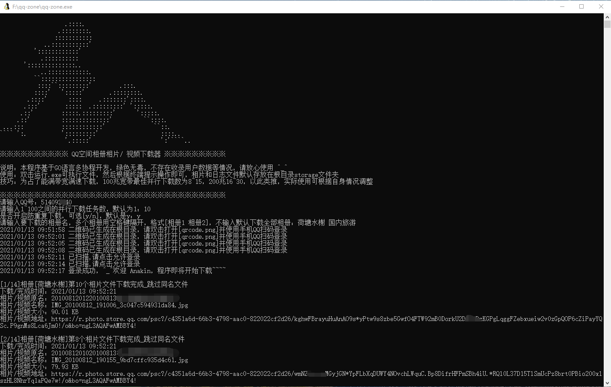

# qq-zone
QQ空间爬虫，多协程并发下载相片/视频

#### 介绍
使用GO语言开发的多协程并发式QQ空间爬虫，通过手机QQ扫码登陆，便可全自动下载相册的相片和视频

#### 环境要求
1. go 1.14.4 (我的环境是这个版本，其他版本应该也没问题)
2. go mod

#### 使用说明一

1. 把项目下载下来 git clone https://github.com/qinjintian/qq-zone.git
2. 进入到qq-zone目录
3. 构建项目 go build 后会在当前目录下生成一个 qq-zone.exe 可执行文件(windows 10 环境，其他环境自行百度构建)
4. 双击运行 qq-zone.exe，根据终端提示输入QQ账号，然后当前目录下会生成扫码登陆的二维码，扫码即可登陆进行自动下载

#### 使用说明二
_**对于不想看代码实现过程，只想直接可以运行使用的情况可以直接下载 qq-zone.exe 可执行文件到本地电脑直接双击运行即可**_

#### 截图
