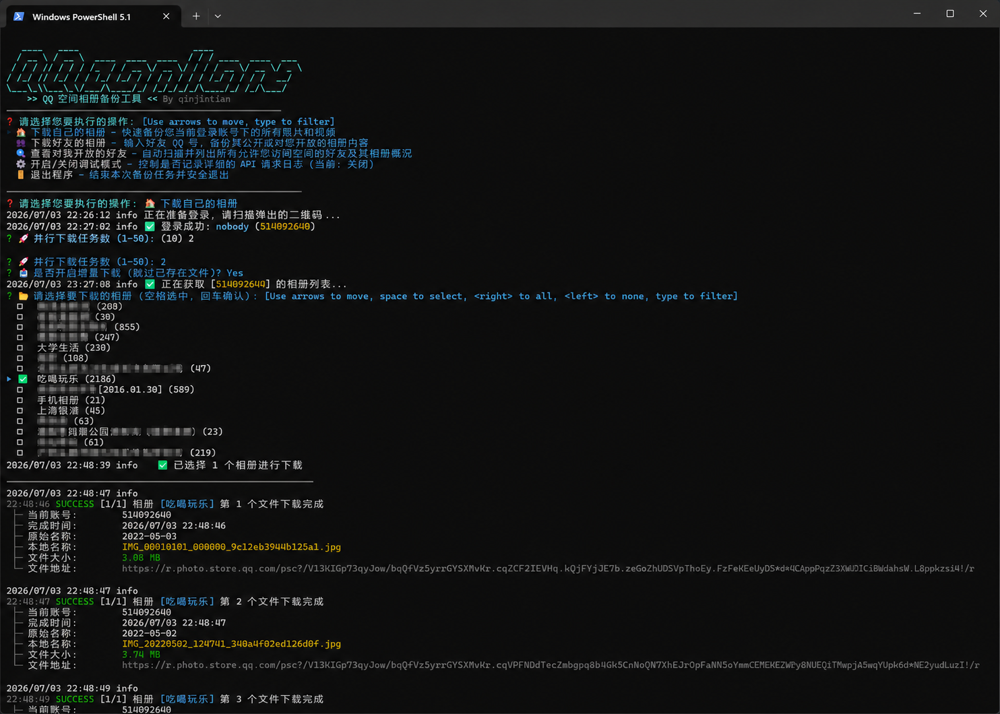

<p align="center">
  <h1 align="center">🚀 QQ-Zone Album Backup Tool</h1>
  <p align="center"><b>一款极简、好用的 QQ 空间相册备份工具，守护您的数字回忆。</b></p>
  <p align="center">
    <a href="https://github.com/qinjintian/qq-zone/releases">
      
    </a>
    <a href="https://golang.org/">
      
    </a>
    <a href="https://github.com/qinjintian/qq-zone/blob/main/LICENSE">
      
    </a>
    <a href="https://github.com/qinjintian/qq-zone">
      
    </a>
    <a href="https://github.com/qinjintian">
      
    </a>
  </p>
</p>

---

## 🌟 简介

**QQ-Zone Album Backup Tool** 是一款专为简化流程而生的 QQ 空间相册备份工具。

在这个数字时代，QQ 空间承载了我们无数的青春记忆。然而，手动备份成千上万张照片不仅繁琐，还容易丢失原图质量。本项目采用 **Go 语言** 深度重构，支持 **原图无损下载** 并 **完整保留 EXIF 元信息**。只需通过 **手机 QQ 扫码登录** 即可一键开启自动化备份流程，将您的珍贵回忆以最原始的状态永久封存在本地。

> **Why choose this?** 拒绝画质压缩！拒绝繁琐的 Cookie 复制！我们提供的是**丝滑**的备份体验。

> **💡 小白用户请看这里**
> 
> 如果你不懂代码、不会配置 Go 语言环境，**请不要点击右上角的绿色 `Code` 按钮下载源码！**
> 
> 请直接点击下方链接，进入发布页面下载已经打包好的现成程序，双击即可运行：
> 
> 👉 [**点击前往 Release 页面下载最新版可执行程序**](https://github.com/qinjintian/qq-zone/releases/latest)
>
> *(Windows 用户请下载 `qq-zone-win.exe`，Mac 用户请下载带有 `macos` 字样的文件)*

## ✨ 核心特性

- 📸 **原图无损备份**：优先获取相册原始分辨率资源，尽可能保留照片 **EXIF 元信息**，把回忆按接近原始档案的状态落到本地。
- ⏱️ **时间线还原**：下载完成后自动将文件修改时间回写为拍摄时间（OS Time 注入），导入系统相册后，时间线不再错乱。
- 🎬 **照片与视频资源兼容下载**：支持普通图片与视频资源下载；对于 QQ 空间中按视频链路返回的实况图内容，会按视频文件方式处理并保存。
- 🔁 **失败任务可追踪、可重试**：每次备份都会生成任务记录，失败项保留相册、账号、照片元数据等完整上下文，可从历史任务列表中手动选择并精准补偿下载。
- 🧷 **断点续传更安全**：支持 Range 续传、`If-Range` 校验、Sidecar 续传元数据和 `416` 坏断点自愈，避免资源变化后继续向旧文件错误拼接。
- ⚡ **智能并发调度**：内置 Worker Pool 动态扩缩容机制，基于真实字节吞吐量和失败反馈自动调节并发，在大视频、慢网络、长连接场景下更稳。
- 🛡️ **风控防御 + 优雅停机**：面对 `403` / `429` 等场景自动指数退避并显示冷却倒计时；支持 `Ctrl+C` 安全退出，尽量确保中断前分片安全落盘。
- 📱 **扫码即用，登录可复用**：支持终端直接展示二维码扫码登录，并持久化 Session 与历史账号记录，后续可一键切换账号，无需反复扫码。
- 📁 **归档与元数据整理**：支持按拍摄时间自动按 `年/月` 归档，并可导出相册 `JSON` 元数据，便于后续检索、迁移和长期保存。
- 🔍 **好友空间可见性扫描**：可一键扫描所有对自己开放的好友空间，输出结构化权限报告，方便快速判断哪些好友相册可备份。
- 🎨 **高可读 CLI 体验**：集成 `mpb` 多进度条、实时速率、自动单位换算和清爽的终端交互，让长时间备份过程更可感知、更安心。

---

## 🚀 快速开始

### 方式一：直接运行 (推荐)
- **从 Release 下载**：前往 [Releases](https://github.com/qinjintian/qq-zone/releases) 页面下载最新的 `qq-zone.exe`。

### 方式二：源码编译
1. **克隆仓库**
   ```bash
   git clone https://github.com/qinjintian/qq-zone.git
   cd qq-zone
   ```
2. **编译项目**
   - **全平台编译 (推荐)**：
     ```powershell
     ./scripts/build.ps1
     ```
     编译产物会生成到本地 `bin/` 目录。
   - **仅编译当前平台**：
     ```bash
     go build -o bin/qq-zone.exe ./cmd/qq-zone
     ```
3. **启动程序**
   ```bash
   ./bin/qq-zone-win.exe      # Windows (amd64)
   ./bin/qq-zone-linux        # Linux (amd64)
   ./bin/qq-zone-macos-intel  # macOS (Intel)
   ./bin/qq-zone-macos-m-series # macOS (Apple Silicon)
   ```

## 📖 使用指南



1. **启动程序**：运行编译好的可执行文件。
2. **扫码登录**：程序启动后会直接在 **CLI 终端显示二维码**，同时在项目根目录下生成 `qrcode.png`。请使用手机 QQ 扫码并确认登录。
3. **功能选择**：登录成功后，通过键盘方向键 `↑` `↓` 选择功能，按 `Enter` 确认。
   - **下载自己相册**：备份当前登录账号的所有媒体文件。
   - **下载好友相册**：输入好友 QQ 号，备份其公开相册。
   - **重试上次失败项**：浏览当前账号下仍存在待处理失败项的历史任务，并手动选择一个任务执行补偿下载。
   - **查看对我开放的好友**：一键扫描好友空间权限。
4. **任务配置**：根据提示设置并发策略（固定并发或智能动态并发）、是否开启增量下载、时间线整理和元数据导出。
5. **相册勾选**：在交互式列表中使用 `Space` (空格) 勾选想要备份的相册，按 `Enter` 开始下载。
6. **任务报告与历史记录**：任务结束后，终端会直接显示任务编号和任务记录路径；任务记录默认保存到 `storage/tasks/*.json`，便于后续排查与失败重试。

---

## 🛠️ 技术栈

| 类别 | 选用方案 |
| :--- | :--- |
| **核心语言** | Go 1.23+ (Modern Features) |
| **依赖注入** | [uber-go/fx](https://github.com/uber-go/fx) |
| **进度渲染** | [vbauerster/mpb/v8](https://github.com/vbauerster/mpb) (Industrial Bars) |
| **HTTP 客户端** | [go-resty/resty/v2](https://github.com/go-resty/resty) |
| **交互式菜单** | [survey/v2](https://github.com/AlecAivazis/survey) |
| **频率限制** | `golang.org/x/time/rate` (Token Bucket) |
| **表格渲染** | [olekukonko/tablewriter](https://github.com/olekukonko/tablewriter) |
| **日志系统** | [uber-go/zap](https://github.com/uber-go/zap) |
| **并发控制** | `golang.org/x/sync/errgroup` |
| **JSON 解析** | [gjson](https://github.com/tidwall/gjson) |

---

## 📁 项目结构

遵循 **Standard Go Project Layout** 规范：

```text
.
├── .github/            # GitHub Actions 自动化构建与发布流水线
├── bin/                # 编译产物 (由于规范不入库，可执行文件请前往 Releases 下载)
├── assets/             # 存放静态资源 (app.ico, app.manifest 等)
├── cmd/                # 程序入口
│   └── qq-zone/        # 主程序入口
├── docs/               # 项目文档与演示资料
├── internal/           # 私有业务逻辑
│   ├── app/            # 核心爬虫引擎
│   ├── cli/            # 终端交互界面
│   ├── net/            # 网络请求封装
│   ├── pkg/            # 公共工具包 (Logger, Util)
│   └── qzone/          # QQ 空间协议实现
├── scripts/            # 跨平台编译脚本 (支持 Windows 下构建全平台二进制程序)
├── storage/            # 数据存储 (日志、相册、任务记录、配置)
└── go.mod              # 依赖管理
```

---

## 🤝 贡献与反馈

如果您觉得这个项目对您有帮助，请给一个 **⭐ Star**！这是对作者最大的鼓励。

- **作者**: qinjintian
- **邮箱**: [514092640@qq.com](mailto:514092640@qq.com)
- **问题反馈**: 请提交 [Issues](https://github.com/qinjintian/qq-zone/issues)

---

<p align="center">
  <b>Made with ❤️ by qinjintian</b>
</p>
