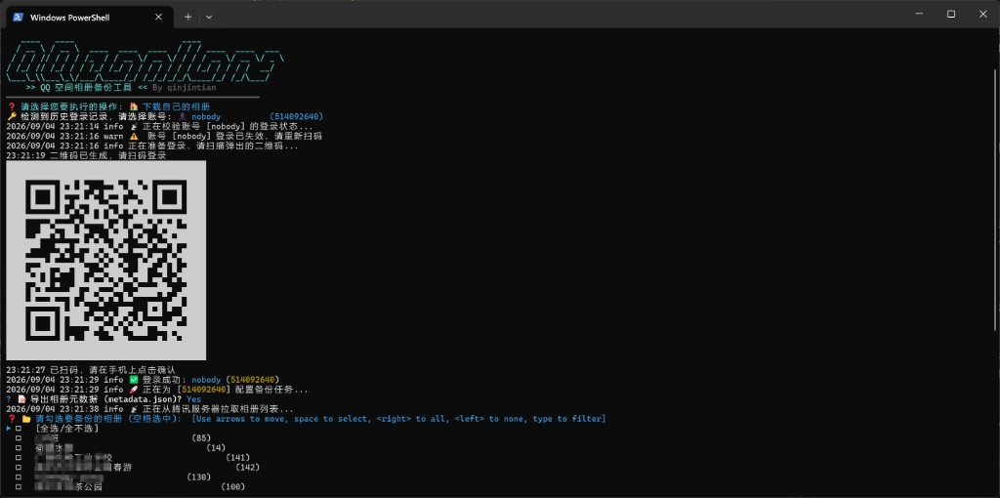

<p align="center">
  <h1 align="center">🚀 QQ-Zone Album Backup Tool</h1>
  <p align="center"><b>一款极简、好用的 QQ 空间相册备份工具，守护您的数字回忆。</b></p>
  <p align="center">
    <a href="https://github.com/qinjintian/qq-zone/releases">
      
    </a>
    <a href="https://golang.org/">
      
    </a>
    <a href="https://github.com/qinjintian/qq-zone/blob/main/LICENSE">
      
    </a>
    <a href="https://github.com/qinjintian/qq-zone">
      
    </a>
    <a href="https://github.com/qinjintian">
      
    </a>
  </p>
</p>

---

## 🌟 简介

**QQ-Zone Album Backup Tool** 是一款专为简化流程而生的 QQ 空间相册备份工具。

在这个数字时代，QQ 空间承载了我们无数的青春记忆。然而，手动备份成千上万张照片不仅繁琐，还容易丢失原图质量。本项目采用 **Go 语言** 深度重构，支持 **原图无损下载** 并 **完整保留 EXIF 元信息**。只需通过 **手机 QQ 扫码登录** 即可一键开启自动化备份流程，将您的珍贵回忆以最原始的状态永久封存在本地。

> **Why choose this?** 拒绝画质压缩！拒绝繁琐的 Cookie 复制！我们提供的是**丝滑**的备份体验。

> **💡 小白用户请看这里**
> 
> 如果你不懂代码、不会配置 Go 语言环境，**请不要点击右上角的绿色 `Code` 按钮下载源码！**
> 
> 请直接点击下方链接，进入发布页面下载已经打包好的现成程序，双击即可运行：
> 
> 👉 [**点击前往 Release 页面下载最新版可执行程序**](https://github.com/qinjintian/qq-zone/releases/latest)
>
> *(Windows 用户请下载 `qq-zone-win.exe`，Mac 用户请下载带有 `macos` 字样的文件)*

## ✨ 核心特性

- 📸 **原图 + EXIF，不是压缩预览**：按相册原始分辨率下载，拍摄信息跟着走，备份下来才是自己的底片。
- 🎬 **能播就能下，地址失效自动换源**：视频、实况图一并收下；点下载 403 时会改走播放地址或 HLS，尽量把文件救回来。
- 📱 **扫码即用，不用复制 Cookie**：终端直接出二维码，手机 QQ 一扫就登录；账号会记住，换号也不用重新折腾。
- 👥 **自己的、好友的，勾了就下**：已有文件自动跳过，隔几个月再跑一遍只补新的。
- 🔁 **失败能重试，中断能续上**：半截文件接着下，下坏了重来；历史任务里还能把失败项单独再跑一次。
- ⏱️ **导入手机后，时间线还是当年**：文件时间写成拍摄时间；也可按年/月归档，并导出相册元数据。
- 🔍 **先看清谁对我开放**：列出能访问的好友空间和公开相册，再决定备份谁。
- 🛡️ **限流会等着，Ctrl+C 停得住**：被减速时自动等待，进度条看得到速度；中途退出尽量不把文件写坏。

> Go 开发者欢迎直接 clone：扫码登录、视频失效换源、安全续传和动态并发都在 `internal/` 里。

---

## 🚀 快速开始

### 方式一：直接运行 (推荐)
- **从 Release 下载**：前往 [Releases](https://github.com/qinjintian/qq-zone/releases) 页面下载最新的 `qq-zone.exe`。

### 方式二：源码编译
1. **克隆仓库**
   ```bash
   git clone https://github.com/qinjintian/qq-zone.git
   cd qq-zone
   ```
2. **编译项目**
   - **全平台交叉编译 (推荐)**：
     ```powershell
     ./scripts/build.ps1    # Windows
     ```
     ```bash
     chmod +x scripts/build.sh   # 首次需要，赋予脚本可执行权限
     ./scripts/build.sh          # Linux / macOS
     ```
     编译产物会生成到本地 `bin/` 目录。
   - **仅编译当前平台**：
     ```bash
     go build -o bin/qq-zone ./cmd/qq-zone
     ```
3. **启动程序**
   ```bash
   ./bin/qq-zone-win.exe      # Windows (amd64)
   ./bin/qq-zone-linux        # Linux (amd64)
   ./bin/qq-zone-macos-intel  # macOS (Intel)
   ./bin/qq-zone-macos-m-series # macOS (Apple Silicon)
   ```

## 📖 使用指南



1. **启动程序**：双击 Release 里的可执行文件，或运行自己编译出的程序。先进入主菜单，选到需要登录的功能时再提示你登录。
2. **登录**：第一次会在终端画出二维码（同时生成 `qrcode.png`），用手机 QQ 扫一下即可。以前登录过会先列出历史账号，选一个就能继续，不用反复扫码。
3. **选功能**：方向键 `↑` `↓` 移动，`Enter` 确认。
   - **下载自己的相册**：备份当前账号的照片和视频。
   - **下载好友的相册**：输入好友 QQ，备份其公开或对你开放的相册。
   - **重试上次失败项**：从历史任务里挑一次记录，只补还没成功的文件。
   - **查看对我开放的好友**：看哪些好友空间你能进、有哪些公开相册。
   - **切换账号 / 重新登录**：换一个已保存的号，或再扫一次码。
4. **配一下任务**：并发填 `auto` 即可；建议打开增量下载（跳过已有文件）、按年/月整理、导出相册元数据。
5. **勾选相册**：空格勾选，也可点「全选」；直接回车则备份全部。`Enter` 开始下载。
6. **看结果**：下完会出任务报告。照片和视频在 `storage/qzone/<QQ号>/album/`，任务记录在 `storage/tasks/`。中途想停按一次 `Ctrl+C`，等当前文件收尾即可。

---

## 🛠️ 技术栈

| 类别 | 选用方案 |
| :--- | :--- |
| **核心语言** | Go 1.23+ (Modern Features) |
| **依赖注入** | [uber-go/fx](https://github.com/uber-go/fx) |
| **进度渲染** | [vbauerster/mpb/v8](https://github.com/vbauerster/mpb) (Industrial Bars) |
| **HTTP 客户端** | [go-resty/resty/v2](https://github.com/go-resty/resty) |
| **交互式菜单** | [survey/v2](https://github.com/AlecAivazis/survey) |
| **频率限制** | `golang.org/x/time/rate` (Token Bucket) |
| **表格渲染** | [olekukonko/tablewriter](https://github.com/olekukonko/tablewriter) |
| **日志系统** | [uber-go/zap](https://github.com/uber-go/zap) |
| **并发控制** | `golang.org/x/sync/errgroup` |
| **JSON 解析** | [gjson](https://github.com/tidwall/gjson) |

---

## 📁 项目结构

遵循 **Standard Go Project Layout** 规范：

```text
.
├── .github/            # GitHub Actions 自动化构建与发布流水线
├── bin/                # 编译产物 (由于规范不入库，可执行文件请前往 Releases 下载)
├── assets/             # 存放静态资源 (app.ico, app.manifest 等)
├── cmd/                # 程序入口
│   └── qq-zone/        # 主程序入口
├── docs/               # 项目文档与演示资料
├── internal/           # 私有业务逻辑
│   ├── app/            # 核心爬虫引擎
│   ├── cli/            # 终端交互界面
│   ├── net/            # 网络请求封装
│   ├── pkg/            # 公共工具包 (Logger, Util)
│   └── qzone/          # QQ 空间协议实现
├── scripts/            # 跨平台编译脚本 (支持 Windows 下构建全平台二进制程序)
├── storage/            # 数据存储 (日志、相册、任务记录、配置)
└── go.mod              # 依赖管理
```

---

## 🤝 贡献与反馈

如果您觉得这个项目对您有帮助，请给一个 **⭐ Star**！这是对作者最大的鼓励。

- **作者**: qinjintian
- **邮箱**: [514092640@qq.com](mailto:514092640@qq.com)
- **问题反馈**: 请提交 [Issues](https://github.com/qinjintian/qq-zone/issues)

---

<p align="center">
  <b>Made with ❤️ by qinjintian</b>
</p>
